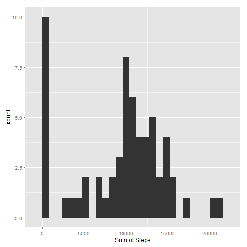
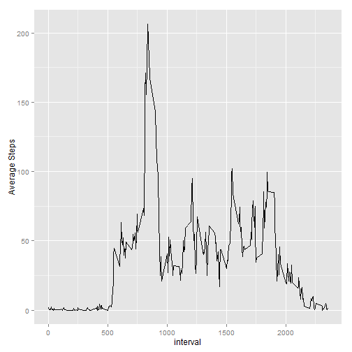
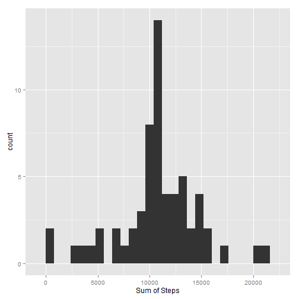
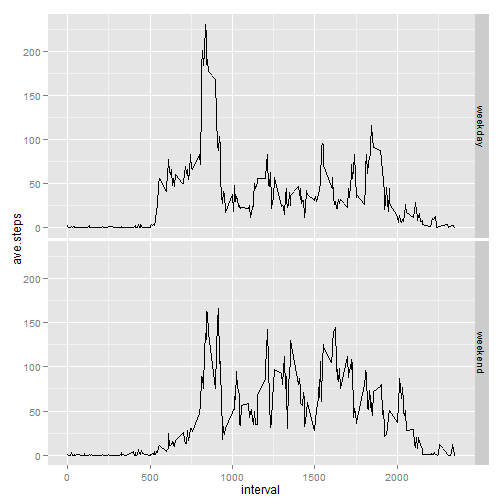

Analysis of Activity Monitoring Data
=====================================

## Introduction
This project is to analyze a set of data collected from a personal activity monitoring device. This device collects data at 5 minute intervals through out the day. The data consists of two months of data from an anonymous individual collected during the months of October and November, 2012 and include the number of steps taken in 5 minute intervals each day.

## Data
The data for this assignment can be downloaded here: [Activity monitoring data] (https://d396qusza40orc.cloudfront.net/repdata%2Fdata%2Factivity.zip)

The variables included in this dataset are:
* __steps__: Number of steps taking in a 5-minute interval (missing values are coded as NA)
* __date__: The date on which the measurement was taken in YYYY-MM-DD format
* __interval__: Identifier for the 5-minute interval in which measurement was taken

The dataset is stored in a comma-separated-value (CSV) file and there are a total of 17,568 observations in this dataset.

## 1.Loading and preprocessing the data
Download the data and put the file in working directory.  
Use `read.csv()` to load the data into a data frame object, d.

```r
d <- read.csv("./activity.csv", colClass = c("numeric", "character", "numeric"))
str(d)
```

```
## 'data.frame':	17568 obs. of  3 variables:
##  $ steps   : num  NA NA NA NA NA NA NA NA NA NA ...
##  $ date    : chr  "2012-10-01" "2012-10-01" "2012-10-01" "2012-10-01" ...
##  $ interval: num  0 5 10 15 20 25 30 35 40 45 ...
```


Variable `date` is read as character. We transform it into `date` class.

```r
d$date <- as.Date(d$date)
str(d)
```

```
## 'data.frame':	17568 obs. of  3 variables:
##  $ steps   : num  NA NA NA NA NA NA NA NA NA NA ...
##  $ date    : Date, format: "2012-10-01" "2012-10-01" ...
##  $ interval: num  0 5 10 15 20 25 30 35 40 45 ...
```


## What is mean total number of steps taken per day?
To answer the question, first we need to sum the steps by date. Here we ignore the NA value.

```r
res1 <- aggregate(d$steps, by = list(d$date), sum, simplify = TRUE, na.rm = TRUE)
names(res1) <- c("date", "sum.steps")
```

Then plot the histogram of the sum of steps.
We need to load `ggplot2` library to use `qplot()`

```r
library(ggplot2)
qplot(sum.steps, data = res1, geom = "histogram", xlab = "Sum of Steps", binwidth = 800)
```

 


Mean and median of total number of steps

```r
mean(res1$sum.steps)
```

```
## [1] 9354
```

```r
median(res1$sum.steps)
```

```
## [1] 10395
```


## What is the average daily activity pattern?
To answer the question, first we need to get the average daily steps for each interval. Here we ignore the NA value.

```r
res2 <- aggregate(d$steps, by = list(d$interval), mean, simplify = TRUE, na.rm = TRUE)
names(res2) <- c("interval", "ave.steps")
```

Then plot the time series.

```r
qplot(interval, ave.steps, data = res2, geom = "line", ylab = "Average Steps")
```

 


Find out the interval with maximum average steps across all the days

```r
res2[with(res2, order(-ave.steps)), ][1, 1]
```

```
## [1] 835
```


## Imputing missing values
How many rows in the original data set containing missing value?

```r
nrow(d[is.na(d), ])
```

```
## [1] 2304
```


Missing values may impose bias on the analysis result, hence we try to use the average steps in that interval across all days to fill in the missing values.  
The average is already calculated in previous section.

```r
d2 <- d
for (i in 1:dim(d2)[1]) {
    if (is.na(d2[i, 1])) {
        d2[i, 1] = res2[res2$interval == d2[i, 3], 2]
    }
}
str(d2)
```

```
## 'data.frame':	17568 obs. of  3 variables:
##  $ steps   : num  1.717 0.3396 0.1321 0.1509 0.0755 ...
##  $ date    : Date, format: "2012-10-01" "2012-10-01" ...
##  $ interval: num  0 5 10 15 20 25 30 35 40 45 ...
```

Repeat the steps in first section to get the mean total.


```r
res3 <- aggregate(d2$steps, by = list(d2$date), sum, simplify = TRUE)
names(res3) <- c("date", "sum.steps")
qplot(sum.steps, data = res3, geom = "histogram", xlab = "Sum of Steps", binwidth = 800)
```

 

Mean and median of total number of steps

```r
mean(res3$sum.steps)
```

```
## [1] 10766
```

```r
median(res3$sum.steps)
```

```
## [1] 10766
```


After the process, we can see that the graph is more concentrated in the middle and mean,median value are higher.

## Are there differences in activity patterns between weekdays and weekends?
First we need another column indicating whether the day is weekday or weekend

```r
Sys.setlocale(category = "LC_TIME", locale = "English")
```

```
## [1] "English_United States.1252"
```

```r
d2$wd <- weekdays(d2$date)
l <- d2$wd == "Sunday" | d2$wd == "Saturday"
d2$wd[l] <- "weekend"
d2$wd[!l] <- "weekday"
d2$wd <- factor(d2$wd)

res4 <- aggregate(d2$steps, by = list(d2$interval, d2$wd), mean, simplify = TRUE)
names(res4) <- c("interval", "wd", "ave.steps")
qplot(interval, ave.steps, data = res4, facets = wd ~ ., geom = "line")
```

 


It shows that the average steps taken in weekend is higher than in weekdays.
